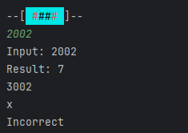

# Stop Resisting!
Stop Resisting! You __can__ learn Resistor Codes!

Inspired by the site created by @sdmtr, I decided to create a C++ project to make a similar game on some embedded hardware with :sparkles: buttons :sparkles: 

The included C++ class should include all logic to get a playable challenge and it supports a multitude of different resistor series.
`main.cpp` describes a terminal application that can be build on a PC, while it is completely functional and can be used as is, the experience in the terminal is not great and it is intended for testing use only. 
A better example of implementation can be found [here](https://github.com/the-real-mcarn/stopresisting-ti84), for the TI-84 CE calculator

## Other links
- [Resistor color code challenge](https://sdmtr.github.io/rccc/)
- [Resistor color code calculator](https://resistorcolorcodecalc.com/)